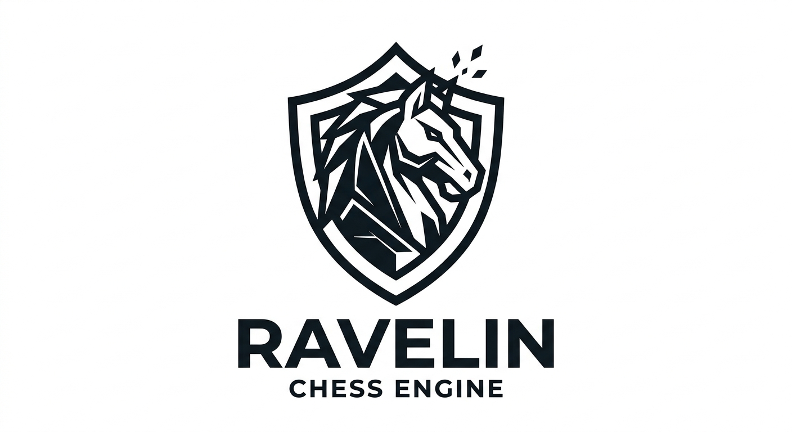

<p align="center">
  
</p>

<p align="center">
  A UCI chess engine written in C# for .NET 10.
</p>

<p align="center">
  <a href="https://github.com/RwnRchrds/Ravelin/actions/workflows/ci.yml"></a>
  <a href="https://github.com/RwnRchrds/Ravelin/actions/workflows/deep-perft.yml"></a>
</p>

---

Ravelin is built correctness-first: move generation is validated against the standard perft
reference values before anything is layered on top of it, and every stage since has kept that
property. It speaks the UCI protocol, so it runs under any chess GUI or against other engines
through `cutechess-cli`.

## Status

Ravelin plays complete, legal games and finds tactics a few plies deep. It is not yet a strong
engine — there is no transposition table, move generation uses ray-walked sliders rather than
magic bitboards, and the evaluation is material plus piece-square tables. Playing strength has
not been measured against a rated opponent.

**Working today**

- Bitboard board representation with make/unmake and full FEN round-tripping
- Legal move generation covering castling, en passant and promotion — perft-verified to 3.2 billion nodes
- Zobrist hashing with incremental updates, validated against a full recompute at every node
- Draw detection: repetition, the fifty-move rule, and insufficient material
- Iterative-deepening alpha-beta with quiescence search and MVV-LVA move ordering
- Evaluation from material and piece-square tables, with a tapered king table
- UCI protocol with a background search thread, so `stop` and `isready` work while thinking

**Not yet**

- Transposition table, magic bitboards, killer/history heuristics, null-move pruning
- Pondering, `MultiPV`, configurable options, opening book, endgame tablebases

## Requirements

The .NET 10 SDK. Development and testing has been on 10.0.201, macOS 26.5 (arm64).

```bash
dotnet --version   # expects 10.x
```

## Build

```bash
git clone <your-remote> Ravelin
cd Ravelin
dotnet build -c Release
```

## Playing against it

The engine binary is a standard UCI executable:

```
src/Ravelin.Uci/bin/Release/net10.0/Ravelin.Uci
```

Point any UCI-capable GUI (Cute Chess, Arena, BanksiaGUI, En Croissant) at that path. To play it
against Stockfish:

```bash
brew install stockfish cutechess     # or your platform's equivalent

cutechess-cli \
  -engine name=Ravelin cmd=./src/Ravelin.Uci/bin/Release/net10.0/Ravelin.Uci proto=uci \
  -engine name=Stockfish cmd=stockfish proto=uci \
  -each tc=10+0.1 -games 20 -pgnout ravelin.pgn
```

Stockfish will win comfortably; the point for now is that games complete cleanly with no illegal
moves, protocol stalls or time forfeits.

### Driving it by hand

```bash
./src/Ravelin.Uci/bin/Release/net10.0/Ravelin.Uci
```

```
uci
position startpos moves e2e4 e7e5
go movetime 3000
```

> **Note:** closing stdin cancels a running search, exactly as `quit` does. GUIs keep the pipe
> open so this never fires in practice, but it means `printf '...' | Ravelin.Uci` will cut a
> search short. Hold stdin open when testing from a shell.

## UCI commands

| Command | Notes |
| --- | --- |
| `uci` | Identifies the engine and replies `uciok` |
| `isready` | Replies `readyok`, including mid-search |
| `ucinewgame` | Resets to the starting position |
| `position startpos \| fen <fen> [moves ...]` | The FEN field count is flexible; an illegal move rejects the whole command |
| `go [wtime btime winc binc movestogo movetime depth nodes infinite]` | Searches on a background thread, emits `info` per depth, then `bestmove` |
| `stop` | Ends the search; `bestmove` follows as it unwinds |
| `quit` | Stops the search and exits |
| `go perft <n>` | Non-standard. Divide output in Stockfish's format, for diffing move generation |
| `d` | Non-standard. Prints a board diagram and the FEN |

`setoption`, `register` and `ponderhit` are accepted and ignored. Unrecognised commands are
ignored, and unknown leading tokens are skipped, as the specification requires.

## Testing

```bash
dotnet test                                  # 161 tests, ~9s
dotnet test -c Release -p:DeepPerft=true     # 169 tests, ~95s
```

The deep perft runs are marked `[Trait("Category", "Slow")]` and excluded by default through
`tests/Ravelin.Tests/default.runsettings`. Passing `-p:DeepPerft=true` disables that filter.
A command-line `--filter` will not work here: VSTest ANDs it with the runsettings filter rather
than replacing it.

Run the deep suite after any change to move generation, make/unmake or the attack tables. In CI it
runs nightly and on demand via the **Deep perft** workflow; the fast suite runs on every push and
pull request against Linux and Windows.

### Perft reference values

All values match the Chess Programming Wiki references exactly.

| Position | Depth | Nodes | In default suite |
| --- | ---: | ---: | :---: |
| Starting position | 5 | 4,865,609 | yes |
| Starting position | 6 | 119,060,324 | deep |
| Starting position | 7 | 3,195,901,860 | deep |
| Kiwipete | 4 | 4,085,603 | yes |
| Kiwipete | 5 | 193,690,690 | deep |
| Position 3 | 6 | 11,030,083 | yes |
| Position 3 | 7 | 178,633,661 | deep |
| Position 4 | 6 | 706,045,033 | deep |
| Position 5 | 5 | 89,941,194 | deep |
| Position 6 | 5 | 164,075,551 | deep |

## Project layout

```
Ravelin.slnx
├── src/
│   ├── Ravelin.Core/        board, move generation, evaluation, search — no I/O
│   │   ├── Types.cs             colours, piece types, squares, castling rights
│   │   ├── Bitboard.cs          masks and bit operations
│   │   ├── Attacks.cs           leaper tables, slider rays
│   │   ├── Move.cs              16-bit packed move
│   │   ├── MoveNotation.cs      UCI long algebraic parsing
│   │   ├── Position.cs          the board, FEN, make/unmake, Zobrist
│   │   ├── Zobrist.cs           hash key tables
│   │   ├── MoveGenerator.cs     pseudo-legal generation plus a legality filter
│   │   ├── Evaluation.cs        material and piece-square tables
│   │   ├── Search.cs            iterative deepening alpha-beta
│   │   └── Perft.cs             node counting and divide
│   └── Ravelin.Uci/         the protocol loop and console entry point
└── tests/
    └── Ravelin.Tests/       xUnit
```

## Design notes

A few choices that are not obvious from the code alone.

**`Position` is a mutable struct with make/unmake.** `MakeMove` updates in place and returns an
`Undo` that restores the exact prior state. All state is inline — the bitboards, occupancy and
mailbox are `InlineArray` fields — so copying a position is safe but wasteful; pass it by `ref`
in hot loops.

**Move generation is pseudo-legal plus a filter.** Each candidate is made, tested for whether it
leaves the mover's king attacked, and unmade. This is slower than tracking pins directly but very
hard to get wrong, which is what the perft suite exists to confirm. Castling is the exception:
its transit-square rules cannot be checked after the fact, so they are checked during generation.

**En passant is hashed only when the capture is actually available.** FEN records an en passant
square after every double push regardless of whether anything can take it. Hashing it
unconditionally would give two functionally identical positions different keys, which silently
breaks repetition detection. `1.d4 Nf6 2.c4` and `1.c4 Nf6 2.d4` therefore have different FENs
but the same Zobrist key.

**`Undo` carries the previous Zobrist key.** Restoring it wholesale is cheaper and far less
error-prone than unwinding each XOR the move applied.

**Quiescence searches all evasions when in check.** Standing pat while in check would let the
search report a position as fine when it is actually lost.

**A single repetition inside the search counts as a draw**, rather than waiting for a third
occurrence. Waiting would let the search walk into a repetition still believing it is winning.
Claiming an actual threefold draw in a game is the GUI's job, not the engine's.

**Slider attacks are walked ray by ray.** `Attacks.Bishop` and `Attacks.Rook` are the seam where
magic bitboards will drop in later without any caller changing.

## Roadmap

Roughly in the order that buys the most strength per unit of risk.

1. **Transposition table** — the Zobrist plumbing is already in place
2. **Magic bitboards** for slider attacks, with the perft suite guarding the swap
3. **Move ordering**: killer moves, history heuristic
4. **Pruning**: null-move, late move reductions, futility
5. **Evaluation**: tapered across all piece types, pawn structure, king safety, mobility
6. Measure it — a fixed opponent and a few hundred games per change, rather than guessing

## Licence

Ravelin is free software: you can redistribute it and/or modify it under the terms of the GNU
General Public License as published by the Free Software Foundation, either version 3 of the
License, or (at your option) any later version.

Ravelin is distributed in the hope that it will be useful, but WITHOUT ANY WARRANTY; without even
the implied warranty of MERCHANTABILITY or FITNESS FOR A PARTICULAR PURPOSE. See the GNU General
Public License for more details.

The full text is in [LICENSE](LICENSE).

Copyright (C) 2026 Rowan Richards.

GPLv3 is the prevailing licence in the chess engine world — Stockfish, Leela Chess Zero and most
of the field use it. Beyond the philosophical case, it is the practical one: reference
implementations of the techniques on the roadmap above are almost all GPL, and copying any of that
code into a permissively licensed project would not be allowed.
